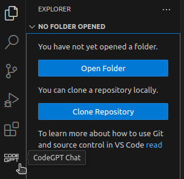
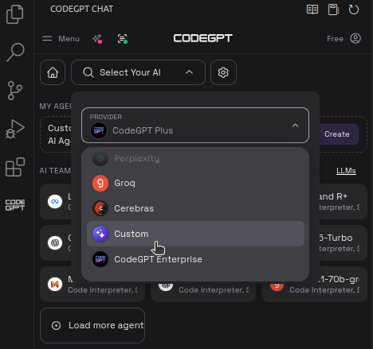
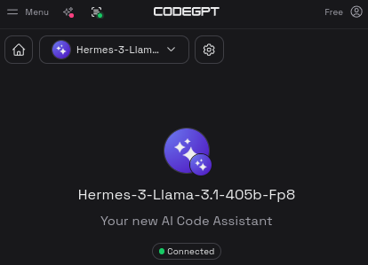
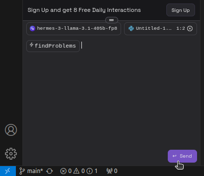
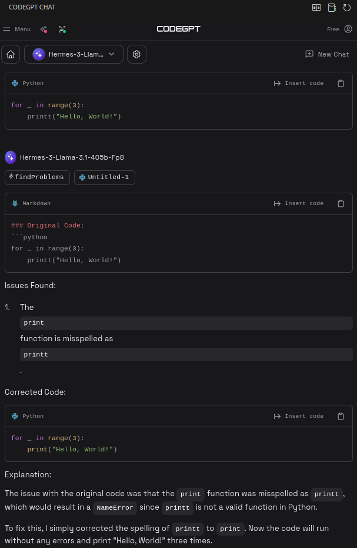

# Integrating Lambda Chat into VS Code

## Introduction

Using the
[CodeGPT VS Code (Visual Studio Code) extension :octicons-link-external-16:](https://marketplace.visualstudio.com/items?itemName=DanielSanMedium.dscodegpt){target="_blank"},
you can integrate
[Lambda Chat :octicons-link-external-16:](https://lambda.chat/chatui/){target="_blank"}
into VS Code. Once integrated, Lambda Chat can help explain code, find problems
in code, and much more.
[See CodeGPT's documentation to learn more :octicons-link-external-16:](https://docs.codegpt.co/docs/intro){target="_blank"}.

For this tutorial, you need to
[generate a Cloud API key :octicons-link-external-16:](https://cloud.lambdalabs.com/api-keys){target="_blank"}.
You can also use an existing Cloud API key.

## Install the CodeGPT extension

1. Open VS Code.

2. Press ++ctrl++ + ++p++ to open **Quick Open**. Enter the following:

    ```
    ext install DanielSanMedium.dscodegpt
    ```

3. Press ++enter++ to install the CodeGPT extension.

## Configure the Lambda Chat integration

1. In the Primary Sidebar, click the **CODEGPT** button.

    

    Select **Select Your AI** > **Provider** > **Custom**.

    <!-- TODO: Replace with animation. There's no visual indication this menu
    scrolls. -->

    

    In the **Model** field, enter:

    ```
    hermes-3-llama-3.1-405b-fp8
    ```

2. Click **Set Connection**.

    In the **ApiKey** field, enter your Cloud API key.

    In the **Custom Link** field, enter:

    ```
    https://api.lambdalabs.com/v1/chat/completions
    ```

3. Click **Connect**.

    You should see:

    

## Test the Lambda Chat integration

1. In the menu bar, select **File** > **New Text File**.

2. Enter a snippet of _broken_ code in the editor, for example:

    ```python
    for _ in range(3):
        printt("Hello, World!")
    ```

3. Select the code, then right-click the code. Choose **CodeGPT: Find
   Problems**.

4. Near the bottom of the Primary Sidebar, click **Send**.

    

    In a few seconds, you should see output similar to:

    
