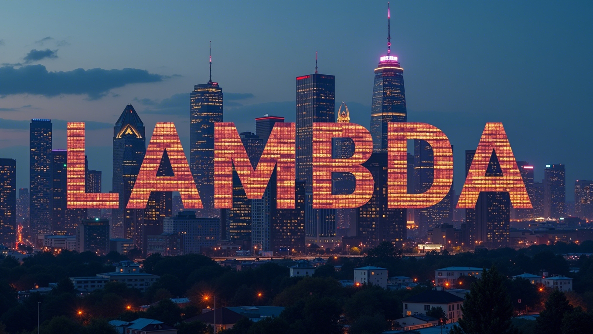

# How to serve the FLUX.1 prompt-to-image models using Lambda Cloud on-demand instances

This tutorial shows you how to use [Lambda
Cloud](https://lambdalabs.com/service/gpu-cloud) A100 and H100 on-demand
instances to download and serve a [FLUX.1 prompt-to-image
model](https://blackforestlabs.ai/). The model will be served as a [Gradio
app](https://www.gradio.app/) accessible with a link you can share.

!!! note

    You can download and serve the [FLUX.1
    [schnell]](https://huggingface.co/spaces/black-forest-labs/FLUX.1-schnell)
    model without a [Hugging Face](https://huggingface.co/) account.

    However, to download and serve the [FLUX.1
    [dev]](https://huggingface.co/black-forest-labs/FLUX.1-dev) model, you
    need a Hugging Face account and a [User Access
    Token](https://huggingface.co/docs/hub/en/security-tokens). You also need
    to review and accept the model license agreement.

## Clone the FLUX.1 inference repository

If you haven't already, use the
[dashboard](https://cloud.lambdalabs.com/instances) or [Cloud
API](https://docs.lambdalabs.com/on-demand-cloud/cloud-api) to launch a 1x or
8x A100 instance, or a 1x or 8x H100 instance. Then, SSH into the instance.
Alternatively, you can use [Jupyter
Notebook](https://docs.lambdalabs.com/on-demand-cloud/getting-started#how-do-i-open-jupyter-notebook-on-my-instance)
to access the instance.

Clone the [FLUX.1 inference GitHub
repository](https://github.com/black-forest-labs/flux) to your home directory
by running:

```bash
cd "$HOME" && git clone https://github.com/black-forest-labs/flux.git
```

Then, change into the repository directory by running:

```bash
cd ~/flux
```

## Install the packages needed to serve the FLUX.1 model

First, create and activate a Python virtual environment for this tutorial by
running:

```bash
python3 -m venv .venv && source .venv/bin/activate
```

Then, install the packages required for this tutorial by running:

```bash
pip install -e '.[all]'
```

## Download and serve the FLUX.1 model

### To download and serve the FLUX.1 [schnell] model

Run:

```bash
python3 demo_gr.py --name flux-schnell --share
```

### To download and serve the FLUX.1 [dev] model

First, log into your Hugging Face account by running:

```bash
huggingface-cli login --token HF-TOKEN
```

Replace **HF-TOKEN** with your Hugging Face User Account Token.

Then, run:

```bash
python3 demo_gr.py --name flux-dev --share
```

The FLUX.1 model is being served as a Gradio app once you see output similar
to:

```
Running on local URL:  http://127.0.0.1:7860
Running on public URL: https://XXXXXXXXXXXXXXXXXX.gradio.live

This share link expires in 72 hours. For free permanent hosting and GPU upgrades, run `gradio deploy` from Terminal to deploy to Spaces (https://huggingface.co/spaces)
```


### Access the Gradio app serving the FLUX.1 model

Open the public URL to access the Gradio app serving the FLUX.1 model.

!!! warning

    Anyone with the public URL can access the Gradio app serving the FLUX.1
    model.

As an example prompt, try:

```
a photo of a city skyline that clearly looks like the letters "Lambda". award winning font architecture, evening hours, some office windows shine through the night, The skyline says "Lambda"
```

With the FLUX.1 [dev] model, this prompt should generate an image similar to:


