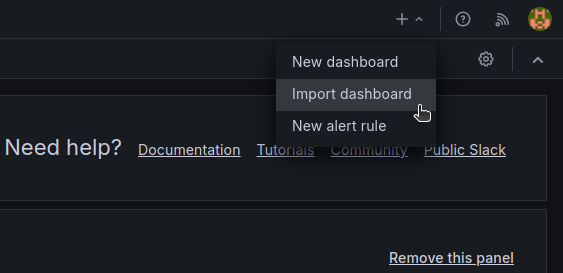
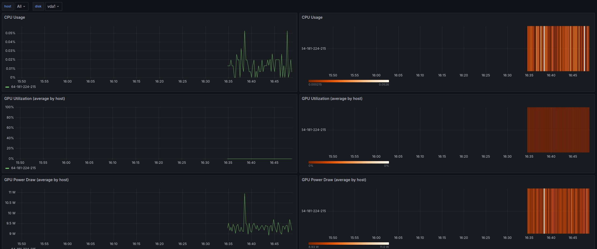

# Installing the guest agent and getting started with Prometheus and Grafana

## Introduction

!!! note

    The guest agent is currently an alpha release. Please report any bugs you
    encounter to [Lambda's Support team
    :octicons-link-external-16:](https://lambdalabs.com/support){target="_blank"}.

You can install the guest agent on your [Lambda Public Cloud
:octicons-link-external-16:](https://lambdalabs.com/service/gpu-cloud){target="_blank"}
on-demand instances to gather metrics such as GPU and CPU utilization.

In this tutorial, you'll install the guest agent and set up [Prometheus
:octicons-link-external-16:](https://www.prometheus.io/){target="_blank"} and
[Grafana :octicons-link-external-16:](https://grafana.com/){target="_blank"} so
you can visualize the collected metrics.

## Install the guest agent

To install the guest agent on an on-demand instance:

1. SSH into your instance by running:

    ```bash
    ssh ubuntu@IP-ADDRESS -L 3000:localhost:3000
    ```

    Replace **IP-ADDRESS** with the actual IP address of your instance.

    !!! note

        The `-L 3000:localhost:3000` option enables local port forwarding. Local
        port forwarding is needed to access the Grafana dashboard you'll create
        in a later step. [See the ssh man page to learn
        more(https://manpages.ubuntu.com/manpages/jammy/en/man1/ssh.1.html).

1. Download and install the guest agent by running:

    ```bash
    curl -L https://lambdalabs-guest-agent.s3.us-west-2.amazonaws.com/scripts/install.sh | sudo bash
    ```

## Set up Prometheus and Grafana

To set up Prometheus and Grafana:

1. Clone the [Awesome Compose GitHub repository
   :octicons-link-external-16:](https://github.com/docker/awesome-compose){target="_blank"}
   and change into the `awesome-compose/prometheus-grafana` directory by running:

    ```bash
    git clone https://github.com/docker/awesome-compose.git && cd awesome-compose/prometheus-grafana
    ```

1. Obtain the private IP address of your instance by running:

    ```bash
    ip -4 -br addr show eno1 | grep -Eo '(25[0-5]|2[0-4][0-9]|[01]?[0-9][0-9]?)\.(25[0-5]|2[0-4][0-9]|[01]?[0-9][0-9]?)\.(25[0-5]|2[0-4][0-9]|[01]?[0-9][0-9]?)\.(25[0-5]|2[0-4][0-9]|[01]?[0-9][0-9]?)'
    ```

1. Edit the `prometheus/prometheus.yml` file.

    Under `targets`, change `localhost:9090` to `PRIVATE-IP-ADDRESS:9101`.

    Replace **PRIVATE-IP-ADDRESS** with the private IP address of your instance,
    which you obtained in the previous step.

    In the `prometheus.yml` file, the `scrape_configs` key should look like:

    ```{.yaml .no-copy}
    scrape_configs:
    - job_name: prometheus
      honor_timestamps: true
      scrape_interval: 15s
      scrape_timeout: 10s
      metrics_path: /metrics
      scheme: http
      static_configs:
      - targets:
        - PRIVATE-IP-ADDRESS:9101
    ```

1. Edit the `compose.yaml` file and set `GF_SECURITY_ADMIN_PASSWORD` to a strong
   password.

    !!! tip

        You can generate a strong password by running:

        ```bash
        openssl rand -base64 16
        ```

1. Start Prometheus and Grafana containers on your instance by running:

    ```bash
    sudo docker compose up -d
    ```

1. In your web browser, go to <http://localhost:3000> and log into Grafana. For
   the username, enter `admin`. For the password, enter the password you set in
   a previous step.

1. At the top-right of the dashboard, click the **+**. Then, choose **Import
   dashboard**.

    

1. In the **Import via dashboard JSON model** field, enter the [example JSON
   model
   :octicons-link-external-16:](https://gist.githubusercontent.com/LandonTClipp/964e90507d660e3fb710b4137be6cd6f/raw/bc7abd797da65581534513c153d1ad3d1b8e4bbe/lambda-guest-agent-grafana-model.json){target="_blank"}
   prepared for this tutorial, then click **Load**. In the following screen,
   click **Import**.

1. You'll see a Grafana dashboard displaying:

    - CPU usage
    - GPU utilization
    - GPU power draw
    - InfiniBand transfer rates
    - local storage transfer rates

    

    !!! note

        On-demand instances, unlike [1-Click
        Clusters](../1-click-clusters/getting-started.md), don't use InfiniBand
        fabric. Accordingly, the InfiniBand transfer rates will always be zero.
